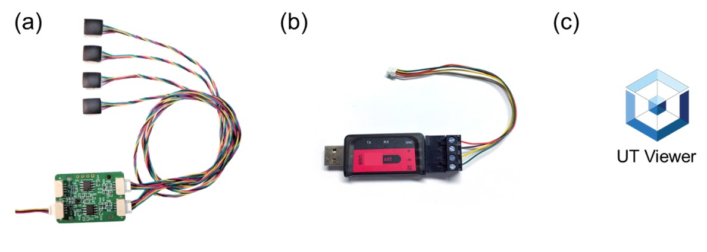
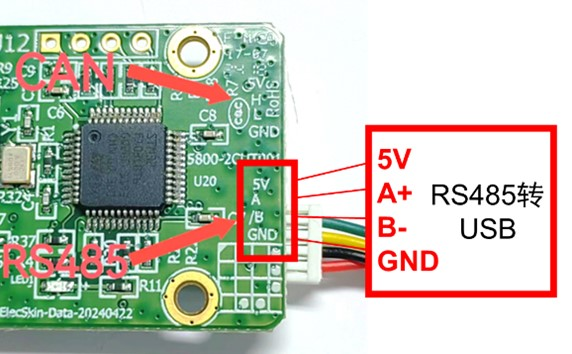
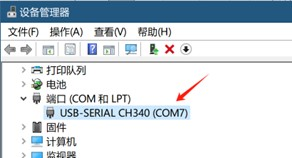
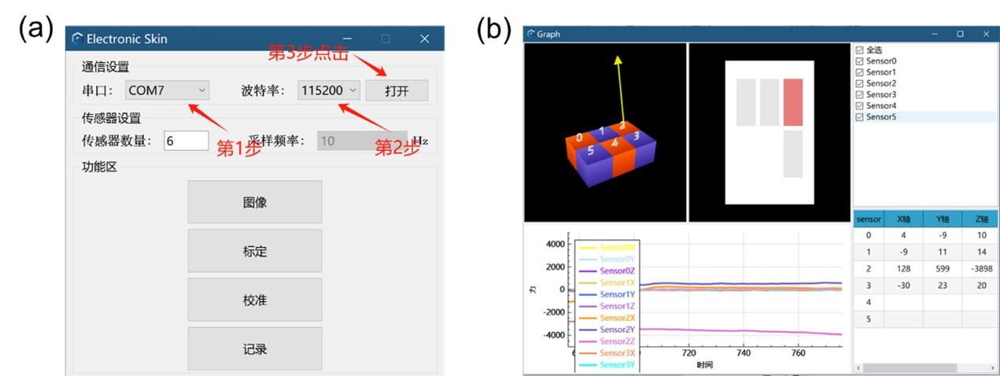
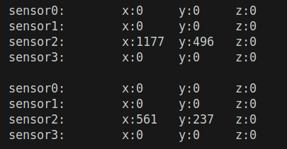
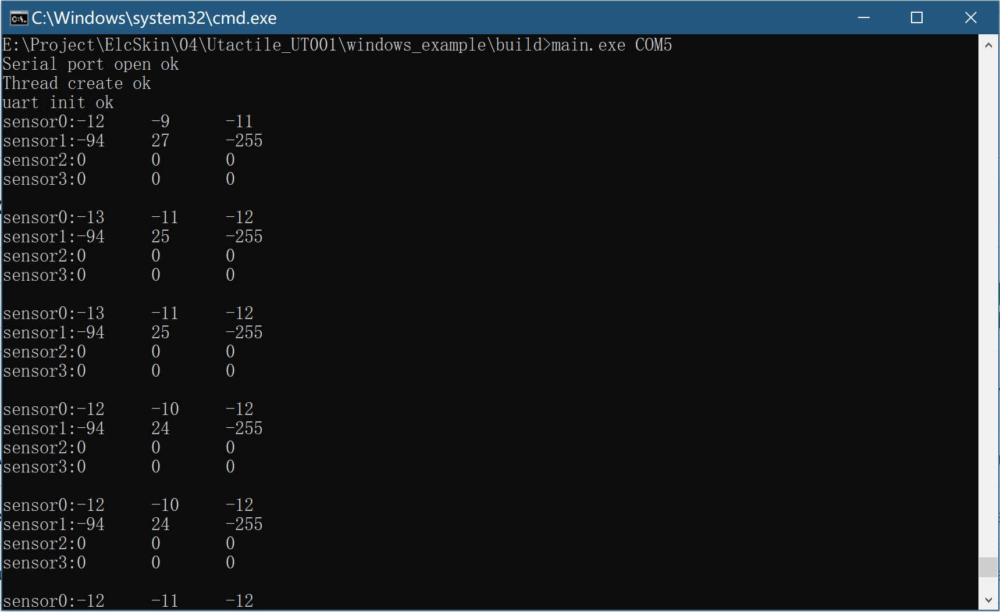
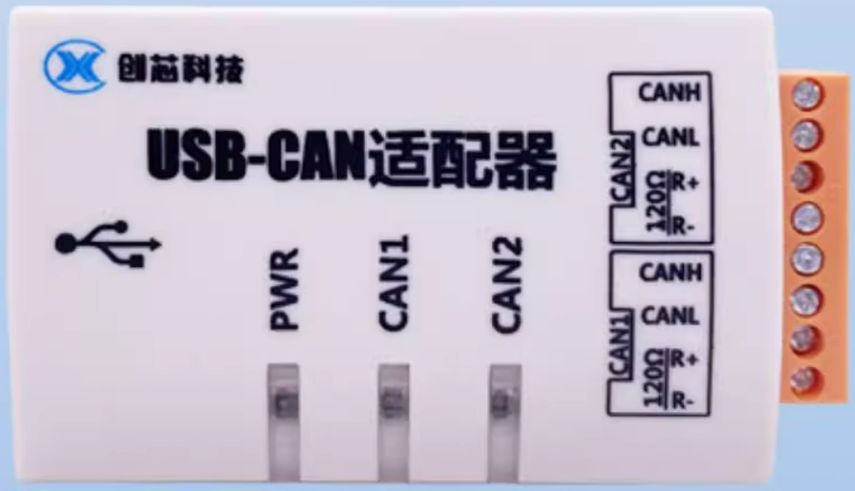
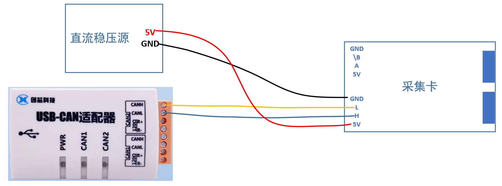
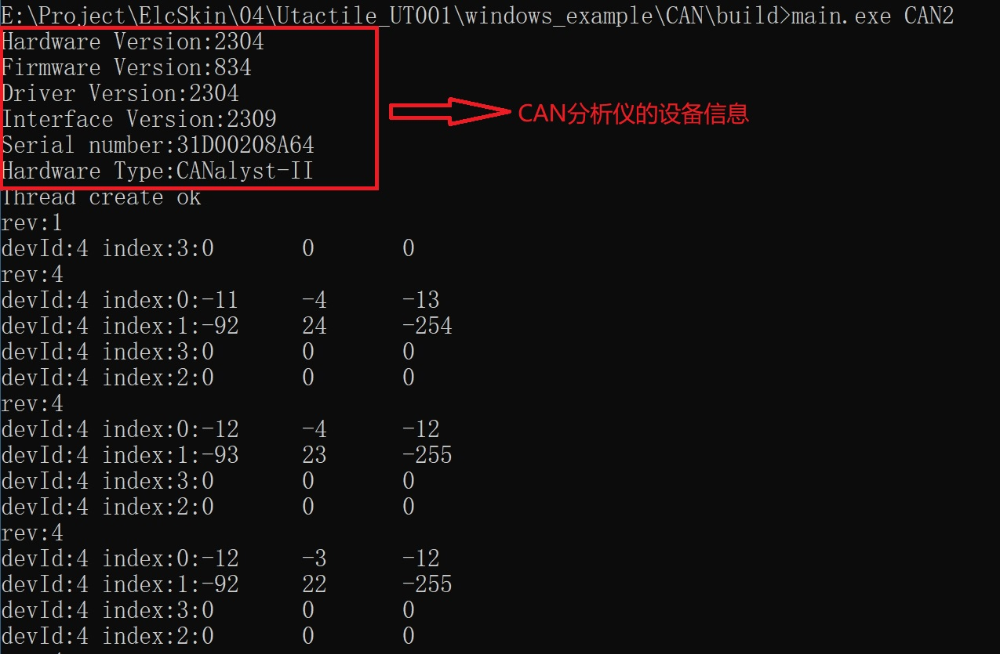

- [UTactile用户指南User Guide](#utactile用户指南user-guide)
- [配套上位机使用指南](#配套上位机使用指南)
- [Linux平台下使用触觉传感器(RS485)](#linux平台下使用触觉传感器rs485)
- [ROS系统下使用触觉传感器(RS485)](#ros系统下使用触觉传感器rs485)
- [windows平台下使用触觉传感器(RS485)](#windows平台下使用触觉传感器rs485)
- [windows平台下使用触觉传感器(CAN)](#windows平台下使用触觉传感器can)
- [UTactile触觉传感器通信协议--RS485](#utactile触觉传感器通信协议--RS485)
  - [协议说明](#协议说明)
  - [数据流格式说明](#数据流格式说明)
  - [数据包详细说明](#数据包详细说明)
  - [上位机发送的数据包](#上位机发送的数据包)
  - [驱动卡发送的数据包](#驱动卡发送的数据包)
- [UTactile触觉传感器通信协议--CAN](#utactile触觉传感器通信协议--CAN)
  - [CAN协议说明](#CAN协议说明)
  - [CAN帧ID说明](#CAN帧ID说明)
  - [CAN命令类型](#CAN命令类型)
  - [CAN上位机发送数据包](#CAN上位机发送数据包)
  - [CAN驱动卡发送的数据包](#CAN驱动卡发送的数据包)

# UTactile用户指南User Guide
# 配套上位机使用指南
本上位机使用Qt进行开发，运行在Windows平台，能够可视化触觉传感器数据，具备矢量箭头，曲线图，数据存储，参数配置等功能，为传感器数据验证和数据分析提供友好的平台。
## 准备工具<!-- omit in toc -->

**图1.** （a） UTactile触觉传感套件，包含传感器模块和数据采集卡；（b）RS485转USB转接头；（c）UT Viewer数据可视化软件。
## 基本使用步骤<!-- omit in toc -->

1.连接数据采集卡与RS485转USB转接头，如图2所示，即接入采集卡上标有5V、A、B、GND的接口，与RS485转USB转接头对应的5V、A+、B-、GND的接口依次连接。

**图2.** 数据采集卡与RS485转USB转接头的连接使用Pin对Pin的连接方式
2.将RS485转USB的USB端接口插入电脑，打开电脑设备管理器（Win10：设置→系统→关于→设备管理器），找到对应的串口号（如本机串口号为：COM7）。

若找不到串口号，可能是缺少相关驱动，尝试使用右键“更新驱动程序”，或根据转接头商家提供的信息，安装CH340或PL2303等对应的串口驱动程序。

**图3.** 确认UTactile触觉传感套件对应的串口号

3.打开配套的主机软件UT Viewer，选择对应的串口号，波特率选择115200，然后单击“打开”按钮。单击“图像”按钮，打开可视化窗口，即可观察传感器的反应。

**图4.** （a）进行通信配置；（b）数据可视化界面，展示对应编号传感器模块的三维触觉的大小和方向，右上角勾选中对应传感模块编号后，即可实时显示x,y,z三个分量的对应曲线。
# Linux平台下使用触觉传感器(RS485)
## 1. 环境要求 <!-- omit in toc -->
本例程中使用Cmake组织工程，在Ubuntu 20.04 LTS下编译通过。
## 2. 连接设备<!-- omit in toc -->
将RS485转USB转换器连接至电脑；
查看设备对应的端口号，

`ls /dev/ttyUSB*`或
`ls /dev/ttyACM*`

如确认端口为ttyUSB0，给端口赋予读写权限，如

`sudo chmod 777 /dev/ttyUSB0`

## 3. 软件包的使用<!-- omit in toc -->
打开main.cpp文件，找到demo_app_init

配置待读取的端口号，如

`demo_app_init("/dev/ttyUSB0")";`

进入linux_example/LinuxDemo/目录下，执行如下命令：

`mkdir build`

`cd build`

`cmake ..`

`make`

生成skin_demo可执行文件并执行
`./skin_demo`
得到如下图所示的数据输出：

数据都存储`app.cpp`文件中的函数`void axit_decode(unsigned char *pData, unsigned short len){}`中的数组变量`tAxit`；

可以通过函数`int axit_get(Axis_t *axit);`获取数据。
# ROS系统下使用触觉传感器(RS485)
## 1. 环境要求<!-- omit in toc -->
本例程中使用Cmake组织工程，在Ubuntu 20.04 LTS下编译通过，使用ROS1操作系统。
#安装rosserial软件包

#install rosserial package

`sudo apt-get install ros-noetic-serial`  #ros为Kinect版本
OR
`sudo apt-get install ros-melodic-serial`  #ros为melodic版本

安装可视化界面软件包

`sudo apt-get install ros-<rosdistro>-joint-state-publisher`

`sudo apt-get install ros-<rosdistro>-robot-state-publisher`

新建工作空间并初始化：

`mkdir -p ~/catkin_ws/src`

`cd ~/catkin_ws/src`

`catkin_init_workspace`

`cd ~/catkin_ws/`

`catkin_make`

#如果使用conda环境，可以使用如下指令进行编译：

#if in conda env,use this command instead:

`catkin_make -DPYTHON_EXECUTABLE=/usr/bin/python3`

#将ros软件包tactile_driver拷贝到工作空间src目录下，并编译：
#copy tactile_driver directory into src floder and compile:

`cd ~/catkin_ws && catkin_make`

`source devel/setup.bash`

#read serial

`ls /dev/ttyUSB0`
OR
`ls /dev/ttyACM0`

`sudo chmod 777 /dev/ttyUSB0`
OR
`sudo chmod 777 /dev/ttyACM0`

单独运行串口数据读取节点

Run the serial port data reading node independently

`rosrun tactile_driver serial_read`

传感器触点数据会发布在"/tactile_data"的话题中，默认发布频率为10Hz

#启动带UI可视化界面的launch文件，显示界面的显示仅供参考，建议直接使用原始数字数据进行处理

传感器触点数据会发布在"/tactile_data"的话题中，默认发布频率为10Hz

#请使用windows上位机软件进行可视化验证，下述带UI可视化界面的launch文件，显示界面的显示仅供参考，工程部署直接使用原始数字数据进行处理。

*（Tips:显示效果可依据需求进行参数更改，此处仅提供代码模版供使用）*

#launch with UI

*(Tips:The display effect can be changed by revising the parameters)*

`roslaunch tactile_driver demo.launch`

# windows平台下使用触觉传感器(RS485)
## 1. 下载并安装MinGW <!-- omit in toc -->
下载地址：https://sourceforge.net/projects/mingw/files/

安装，勾选mingw32-base和mingw32-gcc-g++

或参考如下教程
https://blog.csdn.net/qq_38196449/article/details/136125995

## 2. 安装gcc后确认是否安装成功<!-- omit in toc -->

`gcc --version`

输出类似的信息

`gcc.exe (x86_64-win32-sjlj-rev0, Built by MinGW-W64 project) 8.1.0 Copyright (C) 2018 Free Software Foundation, Inc. This is free software; see the source for copying conditions.  There is NO warranty; not even for MERCHANTABILITY or FITNESS FOR A PARTICULAR PURPOSE.`

## 3. 编译并运行工程，获取数据<!-- omit in toc -->

查看设备对应的端口号 eg. COM5

  a.进入/windows_example/RS485文件夹，使用：cmake -S . -B build -G "MinGW Makefiles" 执行CMakeList.txt文件，会在当前目录下生成build目录。
  
  b.进入build目录：cd build。
  
  c.编译程序：make，会在当前目录下生成可执行文件main.exe。
  
  d.运行程序：hexraw.exe COM5(根据具体的串口号输入，本机中传感器串口号为COM5)
  

得到如下所示的数据输出：

## 4. 输出原始数据 <!-- omit in toc -->
找到main.cpp文件中sensor_output_set(OUTPUT_TYPE_ORIGIN);函数，即可设置传感器输出原始数据。

# windows平台下使用触觉传感器(CAN)
## 1. 下载并安装MinGW <!-- omit in toc -->
下载地址：https://sourceforge.net/projects/mingw/files/

安装，勾选mingw32-base和mingw32-gcc-g++

或参考如下教程
https://blog.csdn.net/qq_38196449/article/details/136125995

## 2. 安装gcc后确认是否安装成功<!-- omit in toc -->

`gcc --version`

输出类似的信息

`gcc.exe (x86_64-win32-sjlj-rev0, Built by MinGW-W64 project) 8.1.0 Copyright (C) 2018 Free Software Foundation, Inc. This is free software; see the source for copying conditions.  There is NO warranty; not even for MERCHANTABILITY or FITNESS FOR A PARTICULAR PURPOSE.`

## 3. CAN分析仪与采集卡的连接<!-- omit in toc -->
本例中使用的CAN分析仪为CANalyst-II，其外观图如下：

由于当前采集卡上CAN总线的丝印标注与实际线序相反，所以其连接示意图如下：

## 4. 安装CAN分析仪驱动<!-- omit in toc -->
安装USB_CAN TOOL软件接口，售卖CAN分析仪的商家一般会提供该软件。

## 5. 编译并运行工程，获取数据<!-- omit in toc -->

  a.进入/windows_example/CAN文件夹，使用：cmake -S . -B build -G "MinGW Makefiles" 执行CMakeList.txt文件，会在当前目录下生成build目录。
  
  b.进入build目录：cd build。
  
  c.编译程序：make，会在当前目录下生成可执行文件main.exe。
  
  d.运行程序：main.exe CAN2(本例演示连接示意图中，采集卡接在CAN分析仪的CAN2总线上，若接在CAN1上，则执行指令为：main.exe CAN1)
  

得到如下所示的数据输出：

## 6. 修改采集卡配置<!-- omit in toc -->
如果需要修改采集卡的采样频率和输出数据类型，修改main.cpp文件下的tCANAlyst.sensor_freq_sample_set和tCANAlyst.sensor_output_set函数传入的参数即可。

# UTactile触觉传感器通信协议--RS485
## 协议说明
数据采用RS485输出，波特率为460800，8位数据，1个停止位，无校验，无流控。数据采用高位在前、低位在后的格式发送，上位机可通过USB口接收。
## 数据流格式说明
### 数据流<!-- omit in toc -->

| Byte[0] | Byte[1] | Byte[2] | Byte[3] | ... | Byte[n-1] | Byte[n] |  
| --- | --- | --- | --- | --- | --- | --- |  
| 头码 | 长度 | 命令类型 | 数据 | ... | 数据 | 校验和 |  

### 头码<!-- omit in toc -->
头码固定为：0xA5。
### 长度<!-- omit in toc -->
表示后面跟随数据的长度。
### 校验码<!-- omit in toc -->
校验码包含头码、长度、命令类型和所有数据的累加和。
### 命令类型<!-- omit in toc -->
当前程序包含如下指令类型。

| 发送方 | 命令类型 |  解析| 备注  |
| ----- | ------- | ---- | --- |
| 驱动板 | 0x00 | 传感器阵列基准后数据 | 包含x、y、z三轴 |
| 驱动板 | 0x01 | 传感器阵列源数据 | 包含x、y、z三轴 |
| 上位机 | 0x80 | 修改驱动卡内的基准数据 | 有回复 |
| 上位机 | 0x81 | 读取当前驱动卡内部基准数据 | 有回复 |
| 上位机 | 0x82 | 设置驱动卡上传的传感器数据类型 | 有回复 |
| 上位机 | 0x83 | 设置传感器数据上报频率 | 有回复 |
| 上位机 | 0x84 | 获取传感器数据上报频率 | 有回复 |

### 回复指令<!-- omit in toc -->
回复指令的格式同4.1数据流，指令命令类型与本次收到指令的命令类型保持一致，数据位参考本次收到指令的说明。如本次收到指令为：A5 03 83 02 2D，当该指令操作成功时，应回复指令为：A5 03 83 00 2B，当该指令操作失败时，应回复指令为：A5 03 83 01 2C。
### 示例<!-- omit in toc -->
如下：
“A5 08 02 00 08 00 02 FF 03 BB”——A5为头码，08代表后面跟随8个字节长度的数据，02该指令的指令类型，BB为校验和，即：A5+08+02+00+08+00+02+FF+03=1BB。
## 数据包详细说明
## 上位机发送的数据包
#### 0x80 修改驱动卡内的基准数据<!-- omit in toc -->
该指令用于设置驱动卡内的基准数据，可设置多个单点传感器，格式为：传感器1索引+传感器1x+传感器1y+传感器1z+传感器2索引+传感器2x+传感器2y+传感器2z+…传感器n索引+传感器nx+传感器ny+传感器nz。

|字节|含义|备注|
|---|---|---|
|Byte[3]|传感器索引| |
|Byte[4~5]|传感器y轴数据|  |
|Byte[6~7]|传感器z轴数据|  |
|Byte[8~9]|传感器x轴数据|  |
|Byte[...]|…|  |
|Byte[3n]|传感器索引n|  |
|Byte[3n+1~3n+2]|传感器n y轴数据| |
|Byte[3n+3~3n+4]|传感器n z轴数据| |
|Byte[3n+5~3n+6]|传感器n x轴数据| |
#### 0x81 读取当前数据采集卡内部基准数据<!-- omit in toc -->
该指令为单指令，没有数据。
#### 0x82设置驱动卡上传的传感器数据类型<!-- omit in toc -->

成功回复0， 失败回复1。
|字节|含义|备注|
|---|---|---|
|Byte[3]|0:使用校准后的数据| |
|  |1:使用源数据| |
#### 0x83设置传感器数据上报频率<!-- omit in toc -->
传感器上报频率设置成功时回复0，失败时回复1。
|字节|含义|备注|
|---|---|---|
|Byte[3]|0:10Hz
| |1:20Hz||
||2:50Hz||
||3:100Hz||
||4:200Hz| |

#### 0x84获取传感器数据上报频率<!-- omit in toc -->
该指令没有数据位，但是需要上报当前传感器的数据上报频率，上报指令数据位的解析如下：
|字节|含义|备注|
|---|---|---|
|Byte[3]|0:10Hz
| |1:20Hz||
||2:50Hz||
||3:100Hz||
||4:200Hz| |
## 驱动卡发送的数据包
### 0x00 传感器阵列基准后数据<!-- omit in toc -->
高位在前，低位在后传输，例如当Byte[3~4]:01 02时，第1个传感器x轴真实数据为0x102。
|字节|含义|备注|
|---|---|---|
|Byte[3]|第1个传感器x轴数据||
|Byte[5~6]|第1个传感器y轴数据||
|Byte[7~8]|第1个传感器z轴数据||
|Byte[9~10]|第2个传感器x轴数据||
|Byte[11~12]|第3个传感器y轴数据||
|…|…| |
|Byte[93~94]|第16个传感器x轴数据||
|Byte[95~96]|第16个传感器y轴数据||
|Byte[97~98]|第16个传感器z轴数据||

### 0x01 传感器阵列源数据数据<!-- omit in toc -->
该数据包用于响应上位机读取基准数据指令，旨在用来查看当前传感器的基准结果。
|字节|含义|备注|
|---|---|---|
|Byte[3~4]|第1个传感器x轴数据||
|Byte[5~6]|第1个传感器y轴数据||
|Byte[7~8]|第1个传感器z轴数据||
|Byte[9~10]|第2个传感器x轴数据||
|Byte[11~12]|第3个传感器y轴数据||
|…|…||
|Byte[93~94]|第16个传感器x轴数据||
|Byte[95~96]|第16个传感器y轴数据||
|Byte[97~98]|第16个传感器z轴数据||

# utactile触觉传感器通信协议--CAN
## CAN协议说明
数据采用CAN输出，波特率为1MBit/s，采用标准帧格式。数据采用高位在前、低位在后的格式发送。

## CAN帧ID说明
|CAN ID bits|[10]~[3]|[2]~[0]|
|---|---|---|
| 功能定义命 |命令类型|设备ID|

CAN设备ID默认为0x4

## CAN命令类型
|发送方|命令类型|解析|备注|
|---|---|---|---|
|驱动板|0x00|传感器力数据|包含x、y、z三轴|
|驱动板|0x01|传感器源数据|包含x、y、z三轴|
|---|---|---|---|
|上位机|0x82|设置驱动卡上传的传感器数据类型|有回复|
|上位机|0x83|设置传感器数据上报频率|有回复|
|上位机|0x84|获取传感器数据上报频率|有回复|

## CAN上位机发送数据包
#### 0x82设置驱动卡上传的传感器数据类型<!-- omit in toc -->
|字节|解析|参考表格和缺省值|
|...|...|...|
|Byte[0]|0:使用力数据 1:使用源数据||

设置成功回复0，失败返回1

#### 0x83设置传感器数据上报频率<!-- omit in toc -->
|字节|解析|参考表格和缺省值|
|---|---|---|
|Byte[0]|0:10Hz||
||1:20Hz||
||2:50Hz||
||3:100Hz||
||4:200Hz||

传感器上报频率设置成功时回复0，失败时回复1。

#### 0x84获取传感器数据上报频率<!-- omit in toc -->
该指令没有数据位，但是需要上报当前传感器的数据上报频率，上报指令数据位的解析如下：
|字节|解析|参考表格和缺省值|
|---|---|---|
|Byte[0]|0:10Hz||
||1:20Hz||
||2:50Hz||
||3:100Hz||
||4:200Hz||

## CAN驱动卡发送的数据包
####  0x00 传感器力数据<!-- omit in toc -->
用于上报传感器的力数据
|字节|解析|参考表格和缺省值|
|---|---|---|
|Byte[0]|传感器索引，0~16||
|Byte[1~2]|第1个传感器x轴数据|-327.00~327.00N|
|Byte[3~4]|第1个传感器y轴数据|-327.00~327.00N|
|Byte[5~6]|第1个传感器z轴数据|-327.00~327.00N|

高位在前，低位在后传输，例如当Byte[1~2]:01 02时，传感器x轴真实数据为0x102。

力数据单位为牛顿，保留两位小数，例如Byte[1~2]为0x102时，实际为2.58N。

####  0x01 传感器源数据<!-- omit in toc -->
用于上报传感器的源数据。
|字节|解析|参考表格和缺省值|
|---|---|---|
|Byte[0]|传感器索引|0~16|
|Byte[1~2]|第1个传感器x轴数据|ADC值|
|Byte[3~4]|第1个传感器y轴数据|ADC值|
|Byte[5~6]|第1个传感器z轴数据|ADC值|

