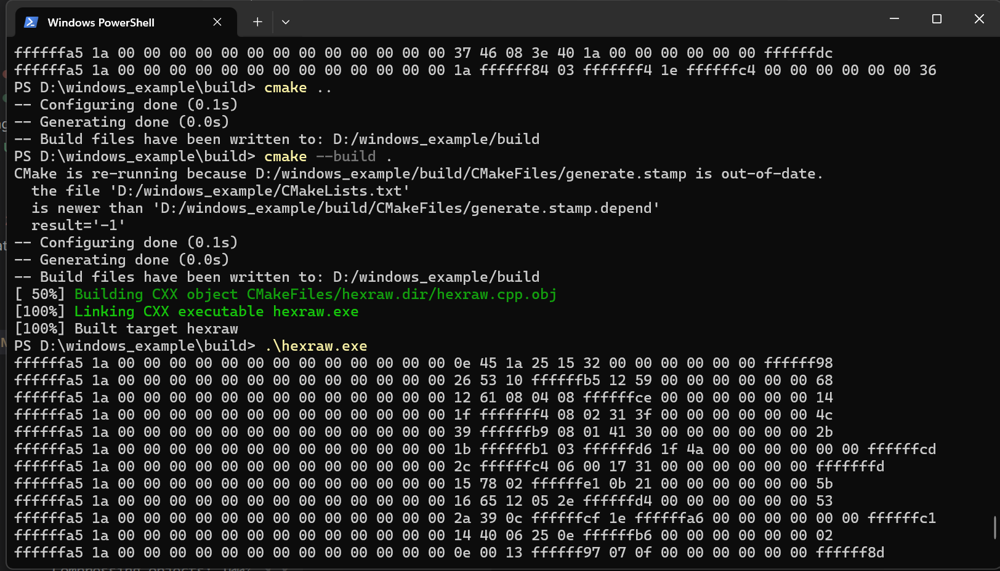

# 用户指南User Guide
# windos平台下使用触觉传感器(RS485)
## 1. 下载并安装MinGW
下载地址：https://sourceforge.net/projects/mingw/files/

安装，勾选mingw32-base和mingw32-gcc-g++

或参考如下教程
https://blog.csdn.net/qq_38196449/article/details/136125995

## 2. 安装gcc后确认是否安装成功

`gcc --version`

输出类似的信息

`gcc.exe (x86_64-win32-sjlj-rev0, Built by MinGW-W64 project) 8.1.0 Copyright (C) 2018 Free Software Foundation, Inc. This is free software; see the source for copying conditions.  There is NO warranty; not even for MERCHANTABILITY or FITNESS FOR A PARTICULAR PURPOSE.`

## 3. 编译并运行工程，获取原始16进制数据
查看设备对应的端口号 eg. COM4
将工程放入不包含中文字符的路径中。
修改hexraw.cpp文件中 const char* portName = "COM4"; // 串口名称  

`mkdir build`

`cd build`

`cmake ..`

`cmake --build .`

`cd \Debug\test`

`.\hexraw.exe`

得到如下所示的数据输出：

## 4. 输出传感器数据
to be continue...

# windos平台下使用触觉传感器(CAN)