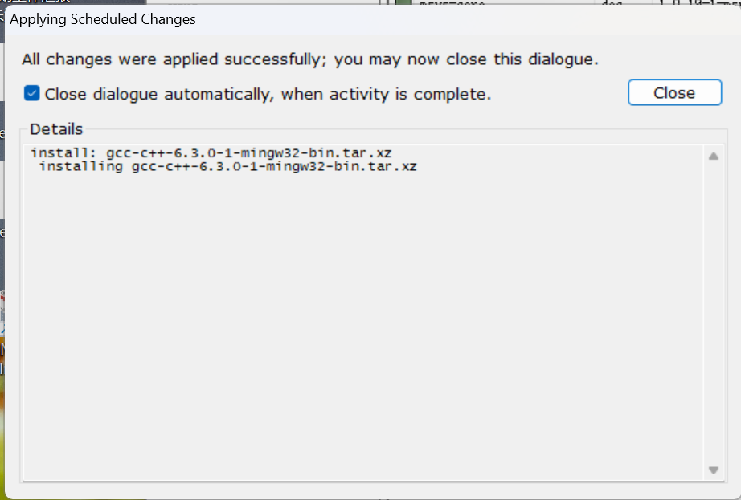

# 一级标题

## 二级标题

### 三级标题

* 1
* 2
1. 1
1. 2

这里是**粗体**这里是*斜体*

> 例如这样

| Tables        | Are           | Cool  |
| ------------- |:-------------:| -----:|
| col 3 is      | right-aligned | $1600 |
| col 2 is      | centered      |   $12 |
| zebra stripes | are neat      |    $1 |

`code block`

分割线
***

## windos平台
1.MinGW下载安装教程
https://blog.csdn.net/qq_38196449/article/details/136125995
